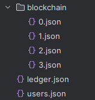

# CryptoCurrency (Sal)

This is a blockchain simulation for my computer science project 

Main interactions: 

Blockchain: 

Users: 

Ledger: 

Structure: 

# How to use?

Run `main_blockchain.py`. This will create and mine the genesis block (root block). 
Run `main_user.py`. This will allow you to interact with the blockchain as a user. 
User Commands: 
• `(1) Create wallet` : Create a wallet by entering username and password. 
• `(2) Sign-in` : Sign-in to a wallet by entering username and password. 
• `(3) Send` : Send sals by entering recipient and amount (Requires wallet). 
• `(4) Balance` : Get current balance (Requires wallet). 
• `q` : Cancel current action. 
• `h` : Show commands menu. 
Run `main_miner.py`. This will allow blocks to be mined. 
Miner Commands: 
• `(1) Sign-in` : Sign-in to a wallet by entering username and password. 
• `(2) Start mining` : Starts mining blocks (Wallet is optional). 
• `(3) Stop mining` : Stops mining blocks. 
• `(4) Balance` : Get current balance (Requires wallet). 
• `q` : Cancel current action. 
• `h` : Show commands menu. 
What miner mines: 
• `wallet_creation` : When a wallet is created, it will only be created when a miner mines a block that has the `wallet_creation` type data. 
• `transaction` : When sals are sent, they will only be transfered when a miner mines a block that has `transaction` type data. 
